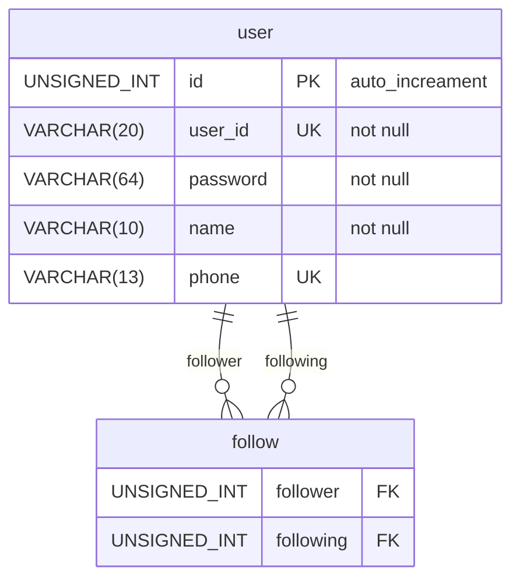

# Realational

```sql
CREATE TABLE user (
    id TINYINT UNSIGNED NOT NULL PRIMARY KEY AUTO_INCREMENT,
    user_id VARCHAR(20) NOT NULL UNIQUE,
    password VARCHAR(64) NOT NULL,
    name VARCHAR(10) NOT NULL UNIQUE,
    phone VARCHAR(13) UNIQUE
);
```

```sql
INSERT INTO user (user_id, password, name) VALUES ("text", "1234", "이정배"), ("carrot", "4321", "박성민");
```

## 게시판 생성

```sql
CREATE TABLE board (
    id INT UNSIGNED PRIMARY KEY AUTO_INCREMENT,
    title VARCHAR(20) NOT NULL,
    created_at DATETIME DEFAULT NOW(),
    writer TINYINT UNSIGNED,
    content VARCHAR(10000) NOT NULL,
    FOREIGN KEY (writer) REFERENCES user(id)
    --- 외래키(FOREIGN KEY)를 사용하여 관계를 DB에게 알려줌
    ON UPDATE CASCADE -- 업데이트된다면 같이 업데이트
    ON DELETE SET NULL -- 삭제될때 같이 삭제
);
INSERT INTO board
(title, writer, content)
VALUES ("타이틀입니다.", 1, "첫글");

SELECT * FROM board; --- 작성자의 id를 찾을 수 있다.
SELCET * FROM user WHERE id=1;
```

## user 삭제

```sql
DROP TABLE user;
```

## board와 user의 관계

```sql
DROP TABLE IF
EXISTS board; --- 있으면 삭제해라
```

1:다의 관계, 하나의 board에 대해 user는 여러개일 수도 있다.

## 1 : ??

```mermaid
erDiagram
user {
    UNSINED_INT id PK "auto_increment"
    VARCHAR(20) user_id UK "not null"
    VARCHAR(64) password "not null"
    VARCHAR(10) name "not null"
    VARCHAR(13) phone UK
}

user_email{
    UNSIGNED_INT id PK PK, FK
    VARCHAR(64) email "not null"
    }

user_nick {
    UNSIGNED_INT id PK
    VARCHAR(64) nick "not null"
    UNSIGEND_INT user_id FK, UK
}

user ||--o{ user_email : id
```

<!-- address {
    UNSIGNED_INT id PK "auto_increment"
    VARCHAR(20) address
    UNSIGNED_INT user_id
} -->

## 다 : 다 || N : M



```
hobby {
    UNSIGNED_INT id PK "auto_increment"
    VARCHAR(20) name UK "not null"
    VARCHAR(10000) information "not null"
}

user_hobby {
    UNSIGNED_INT user FK
    UNSIGNED_INT hobby FK
}
user ||--o{user_hobby : user
hobby ||--o{user_hobby : hobby
```
