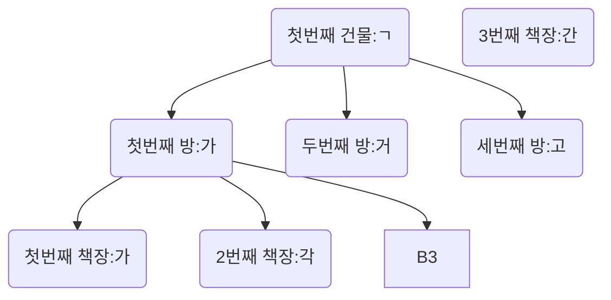

# Index

- 색인

## 얻을 수 있는 장점

<!-- - 찾기 쉽게 하려고?
- 구분하기 쉽게? -->

- MySQL이 데이터를 빠르게 찾기 위해서
- SELECT가 빨라진다.

## 단점

- 그러나 본래 순서가 없는 데이터베이스에 순서를 부여하고 정렬하는 작업이기 때문에 SELECT를 제외한 작업속도가 느려지고, 용량이 무거워진다.
- DML이 느려진다.

## Index를 설정하면

- 설정에 맞춰서 목록을 생성

# 왜 쓸까?

- 왜 빨리 찾아야할까?
  |num|name|
  |---|----|
  |1|김강문|
  |2|박성민|
  |3|방지완|
-

```sql
SELECT * FROM board WHERE id=1;
```

# Index test

```sql
CREATE TABLE board_test (
    id INT UNSIGNED PRIMARY KEY AUTO_INCREMENT,
    title VARCHAR(20) NOT NULL,
    created_at DATETIME DEFAULT NOW(),
    writer TINYINT UNSIGNED,
    content VARCHAR(10000) NOT NULL,
    FOREIGN KEY (writer) REFERENCES user(id)
    --- 외래키(FOREIGN KEY)를 사용하여 관계를 DB에게 알려줌
    ON UPDATE CASCADE -- 업데이트된다면 같이 업데이트
    ON DELETE SET NULL -- 삭제될때 같이 삭제
)
```

# Index를 자동으로 해주는 키

- UNIQUE
- PRIMARY KEY
- FOREIGN KEY

# Index는 어떻게 빠르게 찾을 수 있는가? 목록화를 어떻게 하는가?

## 자료구조

- 순서대로 정리하단.
- 가나다 순으로 책을 정리한다.
- 첫번째 건물 : ㄱ
  - 첫번째 방 : ㄱ \
    - 첫번째 책장 : 가
    - 두번째 책장 : 각
    - 셋번째 책장 : 간
  - 두번째 방 : 거
  - 두번째 건물 : ㄴ

### B-Tree



## CREATE INDEX

```sql
CREATE INDEx idx
idx_board_title ON board_test(title ASC);
```

- ASC : 오름차순
- DESC : 내림차순

# SHOW INDEX

```sql
show INDEX FROM board_test;

```

## DROP INDEX

```sql
DROP INDEX idx_board_title ON board_test;
```
